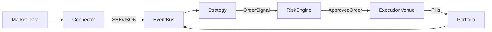

# QuantKubera System Architecture

**Document Version**: 1.0  
**Last Updated**: 2024-12-18  
**IEEE Std 1016-2009 Compliant**

---

## 1. Introduction

### 1.1 Purpose
This document describes the software architecture of QuantKubera, a high-performance quantitative trading system. It serves as a reference for developers, maintainers, and stakeholders.

### 1.2 Scope
QuantKubera is an event-driven trading platform supporting:
- Multi-venue market data ingestion (Binance, CoinDCX, Zerodha)
- Options pricing and risk management (FnO system)
- Low-latency order execution

### 1.3 Definitions
| Term | Definition |
|------|------------|
| SBE | Simple Binary Encoding - compact binary protocol |
| FnO | Futures and Options |
| IV | Implied Volatility |
| Greeks | Option price sensitivities (Δ, Γ, Θ, ν, ρ) |

---

## 2. References

- IEEE Std 1016-2009: Software Design Descriptions
- LMAX Disruptor Architecture
- Black-Scholes-Merton Option Pricing Model (1973)

---

## 3. Design Overview

### 3.1 Architecture Style
LMAX Disruptor-inspired event-driven architecture with ultra-low latency processing.

### 3.2 Data Flow

---

## 4. System Components

### 4.1 Event Bus (`kubera-core`)
Central nervous system using `crossbeam-channel` and `tokio`.
- Decouples market data ingestion from strategy execution
- Latency: ~230ns (verified via benchmarks)

### 4.2 Connectors (`kubera-connectors`)
| Connector | Protocol | Authentication |
|-----------|----------|----------------|
| Binance | SBE/WebSocket | API Key + HMAC |
| Zerodha | REST | TOTP + OAuth |
| CoinDCX | REST + WebSocket | HMAC-SHA256 |

### 4.3 FnO System (`kubera-options`)
| Module | Description |
|--------|-------------|
| Pricing | Black-Scholes with Newton-Raphson IV solver |
| Greeks | Delta, Gamma, Theta, Vega, Rho |
| Risk | SPAN-like margin, VaR/CVaR |
| Analytics | IV Surface 3D, Greeks Heatmap |

### 4.4 Runner & TUI (`kubera-runner`)
- Interactive control plane with real-time metrics
- Multi-venue coordination

---

## 5. Data Design

### 5.1 Event Types
- `MarketEvent`: Ticks, quotes, orderbook updates
- `SignalEvent`: Strategy signals with confidence
- `OrderEvent`: Order lifecycle (new, fill, cancel)

### 5.2 Persistence
- Write-Ahead Log (WAL) for event replay
- JSON-lines format for portability

---

## 6. Interface Design

### 6.1 Latency Profile
| Path | Latency |
|------|---------|
| EventBus (MPSC) | ~230ns |
| SBE Decoding | ~40ns |
| Tick-to-Decision | ~344ns |

### 6.2 Risk Controls
- **Circuit Breakers**: Per-instrument and per-venue
- **Margin Limits**: Worst-case loss calculation
- **Greeks Limits**: Portfolio-level caps on Delta/Gamma
